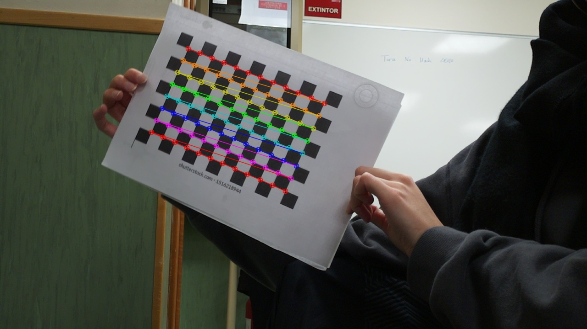

# VOI_ProyectoFinal: Mini game of ping-pong
## Project developed by Isabel V. Morell and Sofía Negueruela

### Introduction
This project involves the use of a Raspberry Pi and the picamera module to design a security system which, once it is unlocked, will enable two players to compete in a ping-pong game where the Raspberry Pi will keep track of the points. To achieve this, we have divided the project in three parts. First, we have calibrated the camera using a chessboard. Then, we have implemented a security system where the password is formed by at least four colors and, lastly, we have developed a tracker that will detect the ping-pong ball's bounces and add the corresponding scores to the players.

### Methodology
#### Camera Calibration
The camera calibration process used OpenCV functions, and employed a chessboard-like pattern for reference. Approximately 30 images were captured using the Raspberry-Pi camera, and went through careful selection process, because while some images showed varied lighting and angles, other ones were discarded. The calibration was completed with edge detection, visually marking the borders for reference as in the picture bellow.

#### Security System
The security system identifies a sequence of color cards displayed one at a time. The sequence acts as a password, whose length can be customized (admiting repetition as well). Using color segmentation techniques, the system validates each card by analyzing frames and counting color-specific pixels. If the correct color is detected, the system proceeds to the next one. After a timeout of 90 seconds without valid input, the process resets.

#### Image transformation sequence
The system captures frames in BGR format and converts them to HSV for segmentation. Having previously defined minimum and maximum HSV values for accurate color detection several times, we got the optimal values for extracting the mask of an image. A binary mask, created from these values, calculates the pixel count for each detected color, ensuring accuracy throughout the process until the full password is entered, and the security system is finally disconected.

#### Ping-pong game tracker
Once the correct password has been detected, the minigame starts. The program starts by calculating the fields thanks to a color segmentation and the Canny edge detector algorithm. The fields are shown in the following image:

After this, the program will keep track of the points scored by the different players using a color-based detection on the ball as well as a Gaussian Mixtures model. The bounces of the ball are detected by detecting the changes in direction of the ball and are then use to calculate de scoring.
The scoring is shown throughout the game in the video until a player wins. In this case, a message stating the winner and the final scoring will be shown.

### Results and next steps
The two output videos can be seen at the folder output. The one associated to the demostration named demo.mp4 is the video called output_tiempo_real_2jugadores.avi. 
As it is shown in the videos, the security system works correctly and efficiently in real team; however, the tracker has some problems detecting some points and giving them to the correct player.

To add to the project, the tracker could be perfected to work in real time and we could add some visual an audio effects like confetti when a point is scored. 
It would also add to the project to mix the different color rectangles of the security system with more figures.